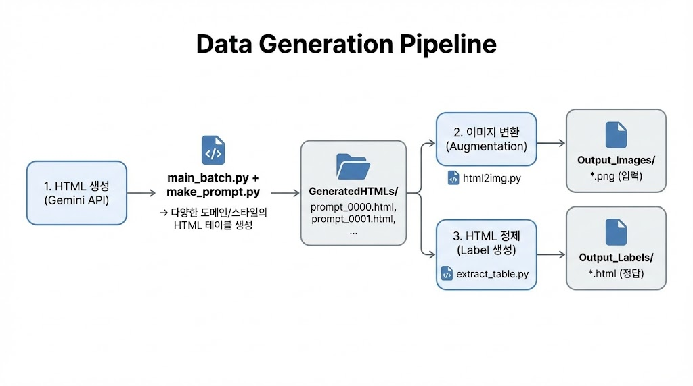

# Table Parsing 모델 파인튜닝을 위한 Synthetic Data 생성

HTML 테이블 이미지와 그에 대응하는 정제된 HTML 라벨을 자동 생성하는 도구입니다.  
Gemini API를 활용하여 다양한 도메인/스타일의 테이블을 생성하고, 이미지-라벨 쌍의 학습 데이터셋을 구축합니다.

## 🎯 프로젝트 목적

- **Table Parsing 모델 학습용 데이터 생성**: 테이블 이미지를 입력받아 HTML 구조를 출력하는 모델 파인튜닝
- **다양성 확보**: 공공기관, 의료, 금융 등 다양한 도메인의 테이블 생성
- **Augmentation 적용**: 색상, 테마, 마진 등을 랜덤하게 변형하여 모델 일반화 성능 향상

## 📊 데이터 생성 워크플로우



## 📁 프로젝트 구조

```
synthetic-table-dataset-gen/
├── GeneratedHTMLs/        # [중간 산출물] 생성된 원본 HTML
├── Output_Images/         # [최종 산출물] 학습용 이미지 (Input)
├── Output_Labels/         # [최종 산출물] 정제된 HTML (Label)
├── run.sh                 # 전체 파이프라인 실행 스크립트
├── main_batch.py          # Step 1: Gemini API로 HTML 테이블 생성
├── make_prompt.py         # 프롬프트 생성기 (main_batch.py에서 호출)
├── html2img.py            # Step 2: HTML → 이미지 변환 (Augmentation)
├── extract_table.py       # Step 3: HTML 정제 (스타일 제거, 라벨 생성)
├── html2img_split.py      # (선택) 긴 테이블 자동 분할
└── gemini_api_key.txt     # Gemini API 키


```

## 🚀 빠른 시작

### 1. 사전 준비

```bash
# 필수 패키지 설치
pip install google-genai playwright beautifulsoup4

# Playwright 브라우저 설치
playwright install chromium

# API 키 설정
echo "YOUR_GEMINI_API_KEY" > gemini_api_key.txt
```

### 2. 전체 파이프라인 실행

```bash
# 기본 실행 (100개 테이블, 각 1개 이미지)
./run.sh

# 커스텀 옵션
./run.sh --num-prompts 500 --images-per-file 3 --color-probability 0.8
```

### 3. 개별 단계 실행

```bash
# Step 1: HTML 생성
python main_batch.py --num-prompts 100 --output-folder GeneratedHTMLs

# Step 2: 이미지 변환 (Augmentation 적용)
python html2img.py --input-dir GeneratedHTMLs --output-dir Output_Images --count 2

# Step 3: 라벨 생성 (스타일 제거된 HTML)
python extract_table.py --input-dir GeneratedHTMLs --output-dir Output_Labels
```

---

## 🔧 주요 스크립트 상세

### 1. `main_batch.py` - Gemini Batch 처리기

Gemini API의 Batch 기능을 사용하여 대량의 HTML 테이블을 생성합니다.

**주요 기능:**

- `make_prompt.py`를 통해 프롬프트 자동 생성
- JSONL 형식의 Batch 요청 파일 생성
- Batch Job 실행 및 상태 모니터링
- 결과 다운로드 및 파일 저장 (이어쓰기 지원)

**사용법:**

```bash
python main_batch.py --num-prompts 100 --output-folder GeneratedHTMLs
```

**옵션:**
| 옵션 | 타입 | 기본값 | 설명 |
|------|------|--------|------|
| `--output-folder` | str | `GeneratedHTMLs` | 출력 폴더 경로 |
| `--api-key-file` | str | `./gemini_api_key.txt` | API 키 파일 경로 |
| `--model` | str | `gemini-2.5-flash` | 사용할 Gemini 모델 |
| `--num-prompts` | int | `100` | 생성할 프롬프트 수 |
| `--temperature` | float | `0.8` | 생성 다양성 (0.0~1.0) |
| `--top-p` | float | `0.9` | Top-P 샘플링 값 |
| `--top-k` | int | `None` | Top-K 샘플링 값 |
| `--max-attempts-count` | int | `1` | 프롬프트당 재시도 횟수 |

---

### 2. `make_prompt.py` - 프롬프트 생성기

다양한 도메인과 스타일의 테이블을 생성하기 위한 가중치 기반 프롬프트를 생성합니다.

**지원 도메인 (가중치):**

- 공공기관 (40%): 주민등록등본, 지출결의서, 회의록, 근로계약서 등
- 의료/병원 (35%): 진료 기록, 검사 결과지, 처방전 등
- 금융/회계 (10%): 손익계산서, 카드 내역, 환율표 등
- 물류/재고 (10%): 재고 목록, 배송 리스트, 발주서 등
- IT/개발 (5%): 에러 로그, API 명세서, DB 스키마 등

**스타일 옵션:**

- 셀 병합 (헤더 병합, 세로 병합, 불규칙 병합)
- 테두리 스타일 (실선, 이중선, 점선, 없음)
- 색상 모드 (흑백, 파스텔톤, 진한색 헤더)
- 글꼴 (궁서체, 고딕체, 타자기체)

**단독 실행:**

```bash
python make_prompt.py  # 10개 샘플 프롬프트 출력
```

---

### `extract_table.py` - HTML 정제 (Label 생성)

HTML 파일에서 `<table>` 요소만 추출하고 모든 스타일 속성을 제거합니다.  
**모델 학습 시 정답(Label)으로 사용됩니다.**

**주요 기능:**

- 마크다운 코드블록 제거 (`html ... `)
- 스타일 관련 속성 제거 (style, class, id, width, height 등)
- 불필요한 공백 및 줄바꿈 정리
- 일괄 처리 지원

**사용법:**

```bash
# 폴더 일괄 처리
python extract_table.py --input-dir GeneratedHTMLs --output-dir Output_Labels

# 단일 파일 처리
python extract_table.py --input-file input.html --output-file output.html
```

**옵션:**
| 옵션 | 타입 | 기본값 | 설명 |
|------|------|--------|------|
| `--input-dir` | str | `GeneratedHTMLs` | 입력 HTML 폴더 |
| `--output-dir` | str | `Output_Labels` | 출력 라벨 폴더 |
| `--input-file` | str | - | 단일 파일 처리 시 입력 파일 |
| `--output-file` | str | - | 단일 파일 처리 시 출력 파일 |

**라벨 예시:**

```html
<table>
  <tr>
    <th>이름</th>
    <th>나이</th>
  </tr>
  <tr>
    <td>김철수</td>
    <td>35</td>
  </tr>
</table>
```

---

### `html2img.py` - 이미지 변환 (Augmentation)

HTML 테이블에 다양한 테마와 스타일을 적용하여 이미지로 변환합니다.  
**모델 학습 시 입력(Input)으로 사용됩니다.**

**주요 기능:**

- 4가지 테마 지원 (gray_clean, soft_card, blue_header, mono)
- 랜덤 테마 가중치 선택
- 배경색이 있는 이미지 추가 생성
- 커스텀 폰트 삽입 (TTF, OTF, WOFF, WOFF2)
- Raw 모드 (변환 없이 그대로 캡처)
- 파일당 다중 이미지 생성

**적용되는 Augmentation:**

- 4가지 색상 테마 (가중치 기반 랜덤 선택)
- 랜덤 마진 (1~5px)
- 파스텔 배경색 추가
- 커스텀 폰트 적용 (선택)

**사용법:**

```bash
# 기본 사용
python html2img.py --input-dir GeneratedHTMLs --output-dir Output_Images

# 다양한 옵션
python html2img.py \
  --input-dir GeneratedHTMLs \
  --output-dir Output_Images \
  --count 3 \
  --color-probability 0.7 \
  --scale 2.0 \
  --font-path ./fonts/NanumGothic.ttf
```

**옵션:**
| 옵션 | 타입 | 기본값 | 설명 |
|------|------|--------|------|
| `--input-dir` | str | `GeneratedHTMLs` | 입력 HTML 폴더 |
| `--output-dir` | str | `Output_Images` | 출력 이미지 폴더 |
| `--count` | int | `1` | HTML당 생성할 이미지 수 |
| `--scale` | float | `2.0` | 이미지 스케일 배율 |
| `--color-probability` | float | `0.7` | 색상 테마 적용 확률 (0.0~1.0) |
| `--no-colored` | flag | `False` | 배경색 이미지 생략 |
| `--raw` | flag | `False` | 스타일 변환 없이 그대로 캡처 |
| `--font-path` | str | `None` | 커스텀 폰트 파일 경로 (TTF/OTF/WOFF/WOFF2) |
| `--theme-weights` | float×4 | `3.0 2.5 0.3 1.5` | 테마별 가중치 (gray_clean soft_card blue_header mono) |
| `--overwrite` | flag | `False` | 기존 파일 덮어쓰기 |

---

### `html2img_split.py` - 자동 분할 이미지 변환기 (선택)

긴 테이블을 행(row) 단위로 자동 분할하여 여러 이미지로 저장합니다.

**주요 기능:**

- 최대 높이 초과 시 자동 분할
- 셀이 중간에 잘리지 않도록 행 단위 분할
- 분할된 이미지에 순번 자동 부여 (`_1`, `_2`, ...)

**사용법:**

```bash
# 디렉토리 처리
python html2img_split.py --input-dir Output_QA --output-dir Output_Images --max-height 2000

# 단일 파일 처리
python html2img_split.py --input-file table.html --output-file output.png --max-height 1500
```

**옵션:**
| 옵션 | 타입 | 기본값 | 설명 |
|------|------|--------|------|
| `--input-dir` | str | `Output_QA` | 입력 HTML 폴더 |
| `--output-dir` | str | `Output_Images` | 출력 이미지 폴더 |
| `--input-file` | str | - | 단일 파일 처리 시 입력 파일 |
| `--output-file` | str | - | 단일 파일 처리 시 출력 파일 |
| `--max-height` | int | `2000` | 분할 기준 최대 높이 (픽셀) |
| `--scale` | float | `2.0` | 이미지 스케일 배율 |
| `--overwrite` | flag | `False` | 기존 파일 덮어쓰기 |

---

## 📦 출력 데이터 형식

### Input (이미지)

```
Output_Images/
├── prompt_0000.png           # 기본 스타일
├── prompt_0000_colored.png   # 배경색 추가
├── prompt_0000_v2.png        # 변형 버전 2
├── prompt_0000_v2_colored.png
└── ...
```

### Label (정제된 HTML)

```
Output_Labels/
├── prompt_0000.html
├── prompt_0001.html
└── ...
```

---

## ⚙️ run.sh 사용법

```bash
./run.sh [OPTIONS]

OPTIONS:
  --num-prompts N        생성할 HTML 테이블 수 (기본: 100)
  --images-per-file N    HTML당 생성할 이미지 수 (기본: 1)
  --color-probability P  색상 테마 적용 확률 0.0~1.0 (기본: 0.7)
  --scale N              이미지 스케일 배율 (기본: 2.0)
  --output-html DIR      생성된 HTML 저장 폴더 (기본: GeneratedHTMLs)
  --output-images DIR    이미지 저장 폴더 (기본: Output_Images)
  --output-labels DIR    라벨 저장 폴더 (기본: Output_Labels)
  --skip-generate        HTML 생성 단계 건너뛰기
  --skip-images          이미지 변환 단계 건너뛰기
  --skip-labels          라벨 생성 단계 건너뛰기
  --help                 도움말 표시

EXAMPLES:
  # 기본 실행
  ./run.sh

  # 500개 테이블, 각 3개 이미지 버전 생성
  ./run.sh --num-prompts 500 --images-per-file 3

  # 이미 생성된 HTML로 이미지만 재생성
  ./run.sh --skip-generate --images-per-file 5

  # 라벨만 재생성
  ./run.sh --skip-generate --skip-images
```

---

## 📋 요구사항

```
google-genai>=0.3.0
playwright>=1.40.0
beautifulsoup4>=4.12.0
```

**Playwright 설치:**

```bash
pip install playwright
playwright install chromium
```
